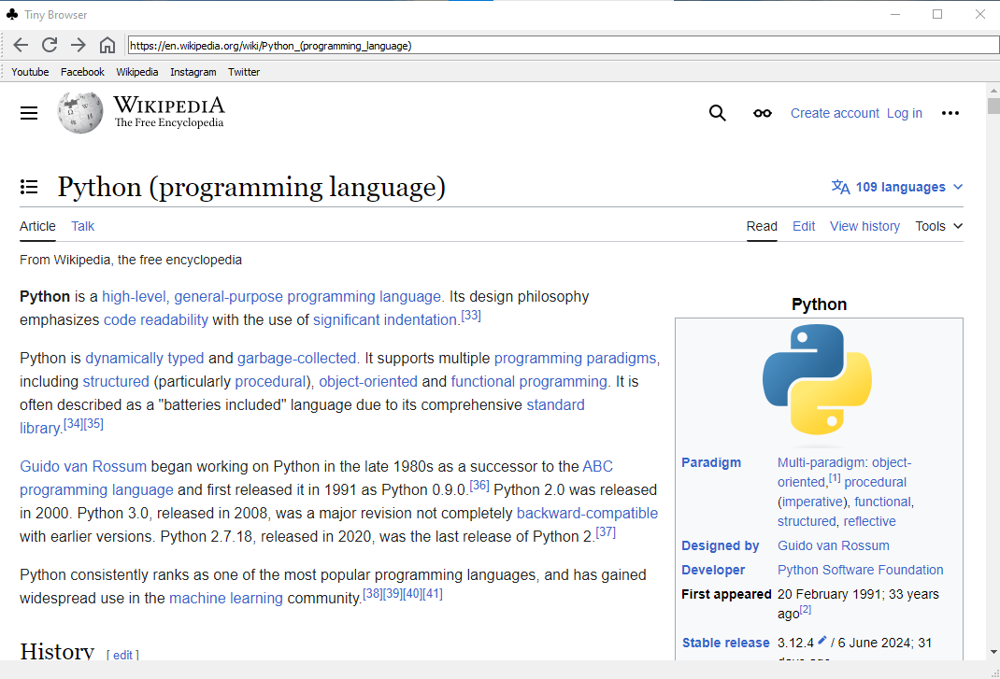

# Tiny Browser 🌎

Tiny Browser is a special one that is very light and simple. made in Python and PyQT5, it supports JavaScript and WebGL and other web technologies. It is open source.

This browser does not have telemetry, it is free, it only supports Windows but the Linux version is still under development.

## Download
### Windows x82_64

|Type|File Name|Link|Size|
|-|-|-|-|-|
|7-Zip Compressed Portable EXE|TinyBrowserPortable.7z|NULL|105 MB|
|7-Zip Compressed Source Code|TinyBrowserSource.7z|NULL|41 KB|
